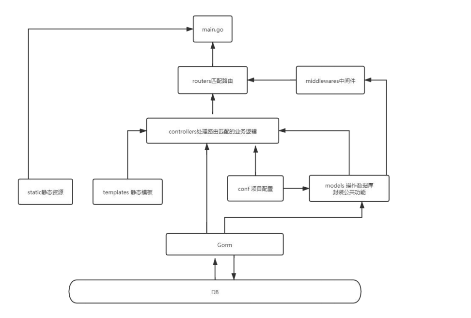

CentOS网络配置

[(32条消息) Linux-教你如何用Xshell连接本地虚拟机_小林Java的博客-CSDN博客_xshell连接虚拟机](https://blog.csdn.net/demo_gsl/article/details/95215372)

https://www.cnblogs.com/wangzy-Zj/p/16821846.html

redis配置

[(32条消息) CentOS安装Redis及redis启动与关闭、配置（详细）_乞力马扎罗の黎明的博客-CSDN博客_centos redis](https://blog.csdn.net/qq_39715000/article/details/120696149)

### 2022.12.07 14:41

#### 0 gin 重走来时路  

##### 热加载配置

golang 热加载工具，gin包里面不包含这个脚手架,beego中是有这个脚手架的。  

脚手架说白了就是按我们目的要求给我们生成满足指定需求的东西
执行 

```shell
go get github.com/pilu/fresh
```
使用```fresh``` 替换 ```go run main.go```

可能bug就是喜欢向我靠近，根据网上的教程都行不通，这个时候群里的大佬就是关键了

```go get``` 执行命令执行之后执行 ```go install```

GOPATH 下的 bin 目录放置的是使用 ```go install``` 生成的可执行文件，

可执行文件的名称来自于编译时的包名

jsonp用来解决跨域问题的，目前只是提了一嘴，一般就是URL携带的参数会显示在json数据之前  

### 2022.12.08 14:30

**沉下心慢慢来，别好高骛远。**

#### 1 模板函数的使用

我们使用以下函数来解析一个文件夹下的所有```template```
```go
r.LoadHTMLGlob("templates/**/*")
```

模板放在不同目录里面的配置方法，我们使用define来给模板定义名称

```html
{{define "模板名称"}}
{{end}}
```

##### **1.1 自定义模板函数**

可以用来对特定的数据进行特定的处理

```go
router.SetFuncMap{
	"模板调用名":"自定义函数名",
}
```
##### **1.2 模板嵌套**

```html
{{template "模板名称" .}}
<!--特别注意后面还有一个点（.）-->
```
#### **2 静态文件服务**

引用静态文件时，我们需要配置静态web服务

```go
//形成路由映射本地文件
r.Static("路由地址","文件路径")
```
#### 3 路由详解

##### 3.1 GET POST 以及获取 GET POST 传值
```go
//GET请求传值
c.Query("参数名")
//如果没有获取，则使用默认值
c.DefaultQuery("参数名","默认值")

//动态路由传值(域名/user/20)
c.Param("uid")

//Post请求传值 获取form表单数据
c.PostForm("参数名（和form表单的name要一致）")

//获取GET POST 传递的数据绑定到结构体
//基于请求的Content-Type识别请求数据类型并利用反射机制自动提取请求中Querystring、from表单、JSON、XML等参数到结构体中
type Userinfo struct{
	Username string `form:"username" json:"user"`
	Passowrd string `form:"password"json:"password"`
}
//使用一个err来接收，然后判断数据接收是否成功
err:=c.Shouldbind(&Userinfo)
//根据不同的请求方法以不同的形式绑定到结构体
r.Get()
r.Post()

//获取Post Xml 数据
b,_:=c.GetRawData()
//互获取到的数据之后使用xml.Unmarshal将其解析到对应的结构体
xml.Unmarshal(b,&article)   
```

##### 3.2 简单的路由组
```go
//使用group函数对路由进行分组
router.Group("路由组名")
```
##### 3.3 Gin路由文件 分组

目前就是直接独立出来一个路由部分，单独建立一个路由的文件夹，里面放路由函数

#### 4 Gin中自定义控制器
##### 4.1 控制器分组

控制器函数中我们定义了空结构体来对处理函数进行**分类**

##### 4.2 控制器的继承
GO语言中没有继承这一概念,说白了就是使用**匿名组合**来实现继承的效果

然后我们就可以将控制器里面的公共方法抽离出来形成一个单独控制器类

#### 5 Gin中间件

gin框架允许开发者在处理请求的过程中，加入用户自己的```钩子(HOOK)函数```。这个钩子函数就叫中间件
中间件适合处理一些公共的业务逻辑，比如登录认证、权限校验、数据分页、记录日志、耗时统计等。  
通俗的讲：中间件就是匹配路由前和匹配路由完成后执行的一系列操作

##### 5.1.1 初识中间件

gin中的中间件必须是一个```gin.HandlerFunc类型```，匹配路由的时候可以传递多个func回调函数，
最后一个func回调函数前面触发的方法都可以称为中间件

##### 5.1.2 ctx.Next()调用该请求的剩余处理程序
中间件里面加上了ctx.Next()可以让我们在路由匹配完成后执行一些操作

比如统计一个请求的时间
```go
package main

import (
	"fmt"
	"github.com/gin-gonic/gin"
	"time"
)
func initMiddleware(ctx *gin.Context) {
	fmt.Println("1-执行中中间件")
	start := time.Now().UnixNano()
	// 调用该请求的剩余处理程序
	ctx.Next()
	fmt.Println("3-程序执行完成 计算时间")
	// 计算耗时 Go 语言中的 Since()函数保留时间值，并用于评估与实际时间的差异
	end := time.Now().UnixNano()
	fmt.Println(end - start)
}
func main() {
	r := gin.Default()
	r.GET("/", initMiddleware, func(ctx *gin.Context) {
		fmt.Println("2-执行首页返回数据")
		ctx.String(200, "首页--中间件演示")
	})
	r.GET("/news", initMiddleware, func(ctx *gin.Context) {
		ctx.String(200, "新闻页面--中间件演示")
	})
	r.Run(":8080")
}
```
##### 5.1.3 一个路由配置多个中间件的执行顺序
##### 5.1.4 c.Abort()
Abort是终止的意思，```c.Abort()```  表示终止调用该请求的剩余处理程序

##### 5.2 全局中间件

使用 ```r.Use()```注册中间件到路由中
##### 5.3 在路由分组中配置中间件
1、为路由注册中间件有以下两种写法
```go
r.Group("/","中间件函数名")

router:=r.Group("/")
router.Use("中间件函数名")
```
##### 5.4 中间件和对应控制器之间共享数据
设置值
```go
ctx.Set("username","张三")
username,_：=ctx.Get("username")
```
中间件设置值
```go
func InitAdminMiddleware(ctx *gin.Context) {
	fmt.Println("路由分组中间件")
	// 可以通过 ctx.Set 在请求上下文中设置值，后续的处理函数能够取到该值
	ctx.Set("username", "张三")
	// 调用该请求的剩余处理程序
	ctx.Next()
}
//控制器获取值
func (c UserController) Index(ctx *gin.Context) {
	username, _ := ctx.Get("username")
	fmt.Println(username)
	ctx.String(http.StatusOK, "这是用户首页 111")
}
```
##### 5.5、中间件注意事项
**gin 默认中间件**
```gin.Default()```默认使用了 Logger 和 Recovery 中间件，其中：

-  Logger 中间件将日志写入 ```gin.DefaultWriter```，即使配置了 ```GIN_MODE=release```。
- Recovery 中间件会 recover 任何 panic。如果有 panic 的话，会写入 500 响应码。

如果不想使用上面两个默认的中间件，可以使用 gin.New()新建一个没有任何默认中间件的路由。
**gin 中间件中使用 goroutine**
当在中间件或 handler 中启动新的 goroutine 时，不能使用原始的上下文```（c *gin.Context）```，必须使用其只读副本```（c.Copy()）```

#### 6 Gin中自定义Model
##### 6.1 关于Model
功能复用：我们可以把公共的功能单独抽取出来作为一个模块(Model)。Model 是逐步抽象的过程，一般我们会在Model里面封装一些公共的方法让不同Controller
使用,也可以在Model 中实现和数据库打交道。
##### 6.2 Model里面封装公共的方法
##### 6.3 控制器中调用Model
##### 6.4 调用Model注册全局模板函数
##### 6.5 Golang Md5 加密
打开 golang 包对应的网站：https://pkg.go.dev/，搜索 md5
**方法一：**
```go
data := []byte("123456")
has := md5.Sum(data)
md5str := fmt.Sprintf("%x", has)
fmt.Println(md5str)
```
**方法二：**
```go
h := md5.New()
io.WriteString(h, "123456")
fmt.Printf("%x\n", h.Sum(nil))
```
####  7 Gin文件上传

**注意**：需要在上传文件的 form 表单上面需要加入``` enctype="multipart/form-data"```
##### 7.1 单文件上传
https://gin-gonic.com/zh-cn/docs/examples/upload-file/single-file/
```go
// 为 multipart forms 设置较低的内存限制 (默认是 32 MiB)
router.MaxMultipartMemory = 8 << 20 // 8 MiB
// 单文件,文件名参数和HTML页面中定义的名字相同
file, _:= c.FormFile("file")
// 上传文件至指定目录
c.SaveUploadedFile(file, dst)
```
##### 7.2 多文件上传--不同名字的多个文件
相同的函数，就是再写一遍然后保存
##### 7.3 多文件上传--相同名字的多个文件
HTML页面的name属性给切片类型，函数遍历保存每个文件
##### 7.4 文件上传 按照日期存储
```go

func (c UserController) DoAdd(ctx *gin.Context) {
	username := ctx.PostForm("username")
	//1、获取上传的文件
	file, err1 := ctx.FormFile("face")
	if err1 == nil {
		//2、获取后缀名 判断类型是否正确 .jpg .png .gif .jpeg
		extName := path.Ext(file.Filename)
		allowExtMap := map[string]bool{".jpg": true, ".png": true, ".gif": true, ".jpeg": true}
		if _, ok := allowExtMap[extName]; !ok {
			ctx.String(200, "文件类型不合法")
			return
		}
		//3、创建图片保存目录 static/upload/20200623
		day := models.GetDay()
		dir := "./static/upload/" + day
		//os.MkdirAll创建多级目录
		if err := os.MkdirAll(dir, 0666); err != nil {
			log.Error(err)
		}
		//4、生成文件名称 144325235235.png
		fileUnixName := strconv.FormatInt(models.GetUnix(), 10)
		//static/upload/20200623/144325235235.png
		saveDir := path.Join(dir, fileUnixName+extName)
		ctx.SaveUploadedFile(file, saveDir)
	}
	ctx.JSON(http.StatusOK, gin.H{"message": "文件上传成功", "username": username})
	// ctx.String(200, username)
}
```
#### 8 Gin中的Cookie

##### 8.1 Cookie 介绍
- HTTP 是无状态协议。简单地说，当你浏览了一个页面，然后转到同一个网站的另一个页面，服务器无法认识到这是同一个浏览器在访问同一个网站。每一次的访问，都是没有任何关系的。如果我们要实现多个页面之间共享数据的话我们就可以使用 Cookie 或者 Session 实现
- cookie 是存储于访问者计算机的浏览器中。可以让我们用同一个浏览器访问同一个域名的时候共享数据
##### 8.2 Cookie能实现的功能
1、保持用户登录状态
2、保存用户浏览的历史记录
3、猜你喜欢，智能推荐
4、电商网站的加入购物车

##### 8.3 设置和获取 Cookie
https://gin-gonic.com/zh-cn/docs/examples/cookie/
设置 Cookie
c.SetCookie(name, value string, maxAge int, path, domain string, secure, httpOnly bool)
第一个参数 key
第二个参数 value
第三个参数 过期时间.如果只想设置 Cookie 的保存路径而不想设置存活时间，可以在第三个参数中传递 nil
第四个参数 cookie 的路径
第五个参数 cookie 的路径 Domain 作用域 本地调试配置成 localhost , 正式上线配置成域名
第六个参数是 secure ，当 secure 值为 true 时，cookie 在 HTTP 中是无效，在 HTTPS 中才有效
第七个参数 httpOnly，是微软对 COOKIE 做的扩展。如果在 COOKIE 中设置了“httpOnly”属性，
则通过程序（JS 脚本、applet 等）将无法读取到 COOKIE 信息，防止 XSS 攻击产生

```go
//获取 Cookie
cookie, err := c.Cookie("name")
```
##### 8.4 多个二级域名共享cookie
1、分别把 a.itying.com 和 b.itying.com 解析到我们的服务器
2、我们想的是用户在 a.itying.com 中设置 Cookie 信息后在 b.itying.com 中获取刚才设置的cookie，也就是实现多个二级域名共享 cookie这时候的话我们就可以这样设置 cookie
c.SetCookie("usrename", "张三", 3600, "/", ".itying.com", false, true)

#### 9 Gin 中的Session
##### 9.1 Session简单介绍
session 是另一种记录客户状态的机制，不同的是 Cookie 保存在客户端浏览器中，而 session保存在服务器上。
##### 9.2 Session的工作流程
当客户端浏览器第一次访问服务器并发送请求时，服务器端会创建一个 session 对象，生成一个类似于 key,value 的键值对， 然后将 key(cookie)返回到浏览器(客户)端，浏览器下次再访问时，携带 key(cookie)，找到对应的 session(value)。
##### 9.3 Gin中使用Session
Gin 官方没有给我们提供 Session 相关的文档，这个时候我们可以使用第三方的 Session 中间件来实现
https://github.com/gin-contrib/sessions
gin-contrib/sessions 中间件支持的存储引擎：
- cookie
- memstore
- redis
- memcached
- mongodb
##### 9.4 基于Cookie存储Session
1、安装 session 包
```go get github.com/gin-contrib/sessions```
```go
package main

import (
	"github.com/gin-contrib/sessions"
	"github.com/gin-contrib/sessions/cookie"
	"github.com/gin-gonic/gin"
)

func main() {
	r := gin.Default()
	// 创建基于 cookie 的存储引擎，secret11111 参数是用于加密的密钥
	store := cookie.NewStore([]byte("secret11111"))
	// 设置 session 中间件，参数 mysession，指的是 session 的名字，也是 cookie 的名字
	// store 是前面创建的存储引擎，我们可以替换成其他存储引擎
	r.Use(sessions.Sessions("mysession", store))
	r.GET("/", func(c *gin.Context) {
		//初始化 session 对象
		session := sessions.Default(c)
		//设置过期时间
		session.Options(sessions.Options{
			MaxAge: 3600 * 6, // 6hrs
		})
		//设置 Session
		session.Set("username", "张三")
		session.Save()

		c.JSON(200, gin.H{"msg": session.Get("username")})
	})
	r.GET("/user", func(c *gin.Context) {
		// 初始化 session 对象
		session := sessions.Default(c)
		// 通过 session.Get 读取 session 值
		username := session.Get("username")
		c.JSON(200, gin.H{"username": username})
	})
	r.Run(":8000")
}
```
##### 9.5 基于Redis 存储 Session
如果我们想将 session 数据保存到 redis 中，只要将 session 的存储引擎改成 redis 即可。
使用 redis 作为存储引擎的例子：
首先安装 redis 存储引擎的包
```go get github.com/gin-contrib/sessions/redis```
```go
package main
import ( "github.com/gin-contrib/sessions"
	"github.com/gin-contrib/sessions/redis"
	"github.com/gin-gonic/gin"
)
func main() {
	r := gin.Default()
	// 初始化基于 redis 的存储引擎
	// 参数说明：
	// 第 1 个参数 - redis 最大的空闲连接数
	// 第 2 个参数 - 数通信协议 tcp 或者 udp
	// 第 3 个参数 - redis 地址, 格式，host:port
	// 第 4 个参数 - redis 密码
	// 第 5 个参数 - session 加密密钥
	store, _ := redis.NewStore(10, "tcp", "localhost:6379", "", []byte("secret"))
	r.Use(sessions.Sessions("mysession", store))
	r.GET("/", func(c *gin.Context) {
		session := sessions.Default(c)
		session.Set("username", "李四")
		session.Save()
		c.JSON(200, gin.H{"username": session.Get("username")})
	})
	r.GET("/user", func(c *gin.Context) {
		// 初始化 session 对象
		session := sessions.Default(c)
		// 通过 session.Get 读取 session 值
		username := session.Get("username")
		c.JSON(200, gin.H{"username": username})
	})
	r.Run(":8000")
}
```
### 2022.12.09 

###  数据库部分
SQL的执行顺序：```from join on  where  group by  having  select  distinct  order by limit```
#### 1 数据操作

有了解的同学可以直接掠过，我就简要写一些常用的命令

##### 1.1 修改指定的数据

```sql
UPDATE users SET status = 10 WHERE username='ityi;
```
##### 1.2 删除指定的数据

```sql
DELETE FROM users WHERE username='php'
```
##### 1.3 统计数量

```sql
select count(1) from nav
select id,name from nav limit 2;
select id,name from nav limit 2,2;
```
##### 1.4 删除指定的表

```sql
DROP TABLE test;
```
#### 2 Mysql 表与表之间的三种关系
##### 2.1 一对一

查找一个文章并显示每个文章的分类
这里有用到```join on ```我就写一下解释吧
```join```说白了就是两个表合在一起了可能有相同的列,就是
第一章表的每一行和第二章表的每一张匹配,如果第一章表有两行
第二张表为三行得到的新表里面就有2*3=6行,on后面跟着限制条件
我觉得和where是差不多的作用效果
##### 2.2 一对多
#####  2.3 多对多
#### 3 Mysql 笛卡尔积连接、内连接、左外连接、右外连
查询数据的时候能不用连接语句尽量不要使用，笛卡尔积连接查询速度最慢，项目中用的比
较多的是内连接
**内连接**:```inner join``` 只返回两个表中连接字段相等的行。
**左外连接**:```left join```返回包括左表中的所有记录和右表中连接字段相等的记录。
**右外连**:```right join```返回包括右表中的所有记录和左表中连接字段相等的记录。

#### 4 Mysql 索引
MySQL 索引的建立对于 MySQL 的高效运行是很重要的，索引可以大大提高 MySQL 的检索速度。
如果没有索引，执行查询时候必须从第一条记录开始，扫描整个表的记录，直到符合要求的记录。如果有了索引，mysql 无需扫描任何记录即可顺序找到目标记录的位置。简单说来， 索引就是提高查找数据速度，数据量越多，效果越明显。

##### 4.1 创建普通索引

```sql
CREATE INDEX indexName ON mytable(username);
create index index_name on class(name);
```
##### 4.2 查看索引

```sql
show index from table_name
show index from class
show index from class\G
```
##### 4.3 删除索引

```sql
drop index index_name on class
```
##### 4.4 创建唯一索引（主键是一种唯一索引）

```sql
create unique index index_name on class(name)
```
##### 4.5 另外一种创建和删除方式

```sql
alter table class add index index_name(name);
alter table class add unique index_name(name);
alter table class drop index index_name;
```

**Mysql 中常见的索引类型**有普通索引、唯一索引、全文索引、空间索引 Spatial这部分内容我慢慢补充吧,我后面写项目的时候一步步帮大家补充完整。

#### 5 Mysql 事务

事务处理可以用来维护数据库的完整性，保证成批的 SQL 语句要么全部执行，要么全部不执行。
目的就是保证事务的一致性，防止出现程序错误或数据库没法连接等异常情况导致数据库的不一致
Mysql 中用 ```BEGIN```, ```ROLLBACK```, ```COMMIT``` 来实现事务:

       - BEGIN 开始一个事务
       - ROLLBACK 事务回滚
       - COMMIT 事务确认
**建表的例子：**

```sql
SET NAMES utf8mb4;
SET FOREIGN_KEY_CHECKS = 0

CREATE TABLE `user` (
`id` int(0) NOT NULL AUTO_INCREMENT, 
`username` varchar(255) CHARACTER SET utf8 COLLATE utf8_general_ci NULL DEFAULT NULL, 
`balance` decimal(10, 2) NULL DEFAULT NULL, 
 PRIMARY KEY (`id`) USING BTREE
) ENGINE = InnoDB CHARACTER SET = utf8 COLLATE = utf8_general_ci ROW_FORMAT = Dynamic;

INSERT INTO `user` VALUES (1, '张三', 100.00);
INSERT INTO `user` VALUES (2, '李四', 100.00);
SET FOREIGN_KEY_CHECKS = 1;
```
**事务的执行：**

```sql
begin;
update user set balance = balance-100 where id=1
rollback;
```
==注意：==
发现一个问题是命令行执行后的结果和Navicat执行后直接查看表的结果会有区别：
是因为只有```commit```之后表中内容才会发生改变，事务才会执行。
还有一个点要注意，```rollback``` 只能在事务里面才能回滚。

#### 6 Mysql 锁

Mysql 中的锁有**表级锁**和**行级锁**，这里主要给大家讲讲最常用的**表级锁**

##### 6.1 添加读锁

可以并发读，但是不能并发写，读锁期间，没释放锁之前不能进行写操作。

```sql
lock table user read;
unlock tables
```


**使用场景**：读取结果集的最新版本，同时防止其他事务产生更新该结果集 主要用在需要数据依存关系时确认某行记录是否存在，并确保没有人对这个记录进行 UPDATE 或者 DELETE 操作

##### 6.2 添加写锁

只有锁表的用户可以进行读写操作，其他用户不行 （并发下对商品库存的操作）

```sql
lock table user write;
unlock tables
```

### 2022.12.12  15.26

### Gin+GORM

详情请看：[GORM 指南 | GORM - The fantastic ORM library for Golang, aims to be developer friendly.](https://gorm.io/zh_CN/docs/index.html)

这部分内容我觉得这个文档已经写的很清楚里，我们可以一个个去敲，这里就不展开讲了

#### GORM 中使用事务

事务处理可以用来维护数据库的完整性，保证成批的 SQL 语句要么全执行，要么全不执行。

#####  禁用默认事务

为了确保数据一致性，GORM 会在事务里执行写入操作（创建、更新、删除）。如果没有这方面的要求，您可以在初始化时禁用它，这将获得大约 30%+ 性能提升。

```go
//使用DB连接数据库后
DB, err = gorm.Open(mysql.Open(dsn), &gorm.Config{SkipDefaultTransaction: true,})

```

GORM 默认会将单个的 create, update, delete 操作封装在事务内进行处理，以确保数据的完整性。
如果你想把多个 create, update, delete 操作作为一个原子操作，Transaction 就是用来完成这个的。

##### 事务

```go
// 开启事务
tx := db.Begin()
// 在事务中做一些数据库操作 (这里应该使用 'tx' ，而不是 'db')
tx.Create(...)
// ...
// 有错误时，手动调用事务的 Rollback()
tx.Rollback()
// 无错误时，手动调用事务的 Commit()
tx.Commit()
```


### 2022.12.15 19:41
### ginMI
#### go-ini
先下载对应依赖包```gopkg.in/ini.v1```
我们查看文档看看对应的方法是怎么使用的

[开始使用 - go-ini/ini (unknwon.io)](https://ini.unknwon.io/docs/intro/getting_started)

自己看文档吧我个人觉得这部分内容不是很难
我个人是这样用的
在utils模块里面放了一个```setting.go```
给个例子你们看看
```go
package utils

import (
	"fmt"
	"gopkg.in/ini.v1"
	"os"
)

var (
	AppMode  string
	HttpPort string
	JwtKey   string

	Db         string
	DbHost     string
	DbPort     string
	DbUser     string
	DbPassWord string
	DbName     string
	//七牛
	AccessKey  string
	SecretKey  string
	Bucket     string
	QiniuSever string
)

func init() {
	cfg, err := ini.Load("config/config.ini")
	if err != nil {
		fmt.Printf("Fail to read file: %v", err)
		os.Exit(1)
	}
	LoadServer(cfg)
	LoadData(cfg)
	LoadQiniu(cfg)
}

func LoadServer(file *ini.File) {
	AppMode = file.Section("server").Key("AppMode").MustString("debug")
	HttpPort = file.Section("server").Key("HttpPort").MustString(":3000")
	JwtKey = file.Section("server").Key("JwtKey").MustString("123456")
}

func LoadData(file *ini.File) {
	Db = file.Section("database").Key("Db").MustString("mysql")
	DbHost = file.Section("database").Key("DbHost").MustString("localhost")
	DbPort = file.Section("database").Key("DbPort").MustString("3306")
	DbUser = file.Section("database").Key("DbUser").MustString("root")
	DbPassWord = file.Section("database").Key("DbPassWord").MustString("123456")
	DbName = file.Section("database").Key("DbName").MustString("ginblog")

}

func LoadQiniu(file *ini.File) {
	AccessKey = file.Section("qiniu").Key("AccessKey").MustString("fXBIBlHwHbcItG4B5XGTkeub4uIfUdxJeFEUl-6t")
	SecretKey = file.Section("qiniu").Key("SecretKey").MustString("v0aXVRCNId1lBoCmkEfjgzd6qzBpdbLBztuVrL49")
	Bucket = file.Section("qiniu").Key("Bucket").MustString("binlog")
	QiniuSever = file.Section("qiniu").Key("QiniuSever").MustString("http://rkllm6psp.hn-bkt.clouddn.com/")

}
```

下面开始进行小米商城项目的编写

我们使用**MVC架构**来编写小米商城项目

架构图：



我先按每天的学习进度进行一个笔记的记录，后面再重新整理一下笔记

2022-12-21 21:16

```html
标签定义及使用说明
<iframe> 标签规定一个内联框架。
<iframe width="100%" height="500px"  name="rightMain" src="/admin/welcome" frameborder="0"></iframe>
一个内联框架被用来在当前 HTML 文档中嵌入另一个文档。
```

说白了就是将一个路由的HTML页面嵌入进另一个HTML页面中去（内嵌了一个浏览器访问指定的src）

作用：点击左侧工具栏页面URL不发生改变，但是内嵌进的浏览器访问了指定页面，target="名称" 要和 iframe 里面的name="名称" 保持一致

2022-12-22 9:39

#### Gin中使用 base64Captcha 生成图形验证码以及分布式架构中配置 Captcha

##### 一、涉及的库

```go
go get -u github.com/mojocn/base64Captcha
```

##### 二、base64Captcha的基本使用

##### 三、base64Captcha 的数据存储到 Redis 中

